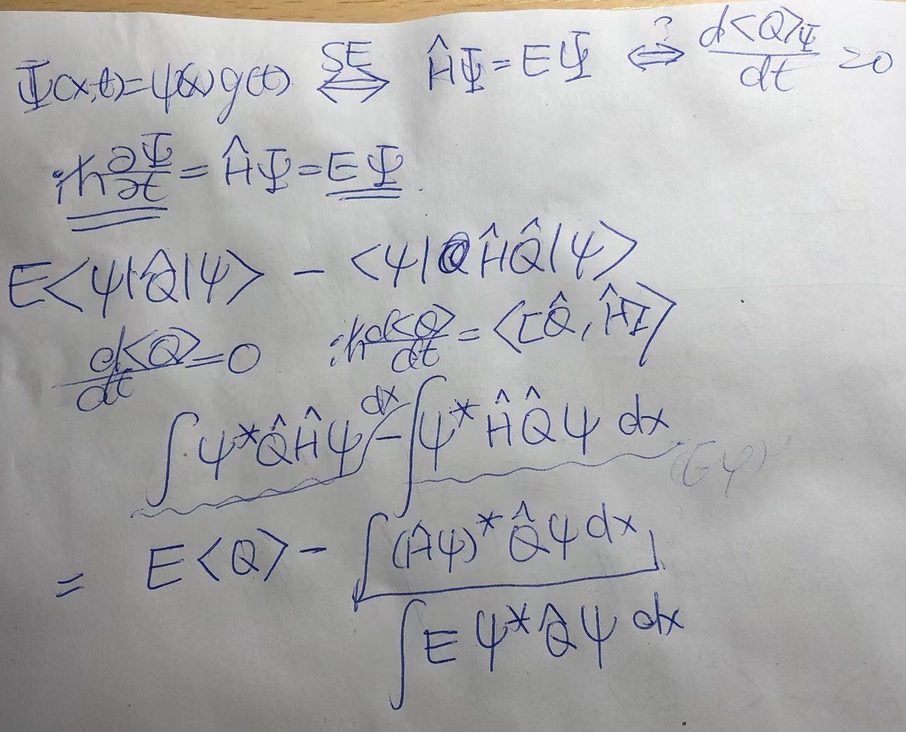
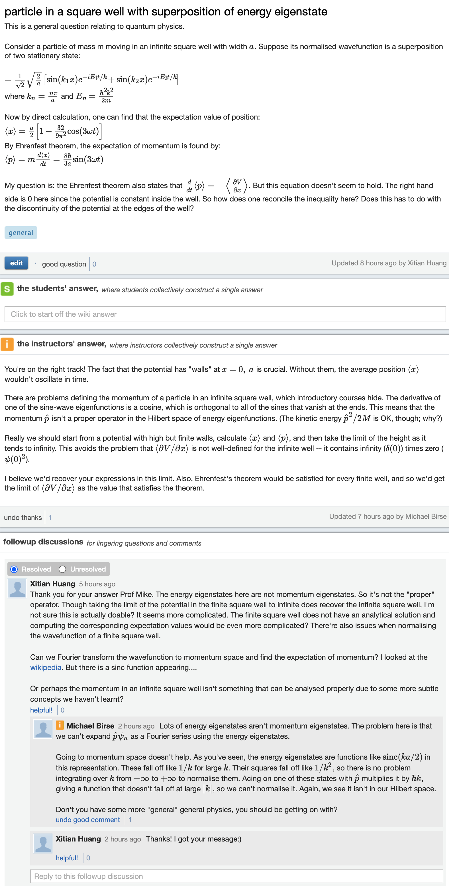

> Look at p96 Algebra(Artin) Prop 3.6.6
relate this to exclusion-inclusion principle

> Radiative collapse of a classical atom.
photon cannot be completely absorbed by single free electrons

> equivalence of **stationary states** and **energy eigenstates**
> 
> 
 

> 

